Wholesale Customer Spending Clustering via Heirarchal Clustering
================
Rex Manglicmot
2022-12-19

-   <a href="#status-continuing-working-document"
    id="toc-status-continuing-working-document">Status: Continuing Working
    Document</a>
-   <a href="#introduction" id="toc-introduction">Introduction</a>
-   <a href="#loading-the-libraries" id="toc-loading-the-libraries">Loading
    the Libraries</a>
-   <a href="#loading-the-data" id="toc-loading-the-data">Loading the
    Data</a>
-   <a href="#cleaning-the-data" id="toc-cleaning-the-data">Cleaning the
    Data</a>
-   <a href="#exploratory-data-analysis"
    id="toc-exploratory-data-analysis">Exploratory Data Analysis</a>
-   <a href="#clustering" id="toc-clustering">Clustering</a>
    -   <a href="#applications" id="toc-applications">Applications</a>
    -   <a href="#pros" id="toc-pros">Pros</a>
    -   <a href="#cons" id="toc-cons">Cons</a>
-   <a href="#limitations" id="toc-limitations">Limitations</a>
-   <a href="#conclusions" id="toc-conclusions">Conclusions</a>
-   <a href="#appendix" id="toc-appendix">Appendix</a>
-   <a href="#inspiration-for-this-project"
    id="toc-inspiration-for-this-project">Inspiration for this project</a>

## Status: Continuing Working Document

Things to do/Questions:

-   Zoom in on dendrograms
-   smaller font on x-axis of dendrogram
-   customize dendrogram aesthetics

## Introduction

<center>


</center>

Understanding consumer behavior is key across all industries and
relevant in regions. It allows businesses/organizations to answer
questions such as if existing customer would likely buy a new product we
developing in R&D? Or, it can answer consumer purchasing frequencies
throughout the year? Thus, clustering observations into groups/segments
has a powerful effect on how business operate. Further there are two
general priorities businesses need to do: what individuals segments
belong together and 2) how do we group them together.[^1]

In terms of wholesale, we can see what groups of people are buying in
bulk at a wholesale people.

The objective of doing this project is to ascertain what commodities are
in high demand. By identifying such commodities local and state
government can plan initiatives to store and prevent inflation thereby
lowering the burden on the end-user consumer.

1)  FRESH: annual spending (m.u.) on fresh products (Continuous);
2)  MILK: annual spending (m.u.) on milk products (Continuous);
3)  GROCERY: annual spending (m.u.)on grocery products (Continuous);
4)  FROZEN: annual spending (m.u.)on frozen products (Continuous)
5)  DETERGENTS_PAPER: annual spending (m.u.) on detergents and paper
    products (Continuous)
6)  DELICATESSEN: annual spending (m.u.)on and delicatessen products
    (Continuous);
7)  CHANNEL: customers’ Channel - Horeca (Hotel/Restaurant/Café) or
    Retail channel (Nominal)
8)  REGION: customers’ Region – Lisnon, Oporto or Other (Nominal)

## Loading the Libraries

``` r
#load libraries
library(tidyverse)
library(janitor)
library(scales)
library(ggplot2)
library(dendextend)
```

## Loading the Data

``` r
#load csv file from the UCI website and store it into an object
data_orig <- read.csv('Wholesale customers data.csv')

#view first few rows of the data
head(data_orig)
```

    ##   Channel Region Fresh Milk Grocery Frozen Detergents_Paper Delicassen
    ## 1       2      3 12669 9656    7561    214             2674       1338
    ## 2       2      3  7057 9810    9568   1762             3293       1776
    ## 3       2      3  6353 8808    7684   2405             3516       7844
    ## 4       1      3 13265 1196    4221   6404              507       1788
    ## 5       2      3 22615 5410    7198   3915             1777       5185
    ## 6       2      3  9413 8259    5126    666             1795       1451

## Cleaning the Data

``` r
#make a copy
data <- data_orig

#make the columns to lowercase
data <- janitor::clean_names(data)

#get rid of the categorical variables since clustering deals with continuous variables
data <- data[,-c(1,2)]

#change column names to something shorter
colnames(data) <- c("fres", "milk", "groc", "fro", "depa", "deli")
```

``` r
#check for NAs
sum(is.na(data))
```

    ## [1] 0

``` r
#check for blanks
sum(data =='')
```

    ## [1] 0

``` r
# one more check for blanks
which(data =='', arr.ind=TRUE)
```

    ##      row col

``` r
#one last check
summary(data)
```

    ##       fres             milk            groc            fro         
    ##  Min.   :     3   Min.   :   55   Min.   :    3   Min.   :   25.0  
    ##  1st Qu.:  3128   1st Qu.: 1533   1st Qu.: 2153   1st Qu.:  742.2  
    ##  Median :  8504   Median : 3627   Median : 4756   Median : 1526.0  
    ##  Mean   : 12000   Mean   : 5796   Mean   : 7951   Mean   : 3071.9  
    ##  3rd Qu.: 16934   3rd Qu.: 7190   3rd Qu.:10656   3rd Qu.: 3554.2  
    ##  Max.   :112151   Max.   :73498   Max.   :92780   Max.   :60869.0  
    ##       depa              deli        
    ##  Min.   :    3.0   Min.   :    3.0  
    ##  1st Qu.:  256.8   1st Qu.:  408.2  
    ##  Median :  816.5   Median :  965.5  
    ##  Mean   : 2881.5   Mean   : 1524.9  
    ##  3rd Qu.: 3922.0   3rd Qu.: 1820.2  
    ##  Max.   :40827.0   Max.   :47943.0

Great we see there are no characters or letters in our dataset since
having one would throw off the summary function.

## Exploratory Data Analysis

How much do people spend on fresh versus frozen? Let’s display it.

``` r
#fresh and frozen scatterplot
ggplot(data, aes(fres, fro)) +
  geom_point(position = 'jitter', alpha=0.5, color= '#FFBF00') +
  scale_y_continuous(trans = 'log10', labels = dollar) +
  scale_x_continuous(trans = 'log10', labels = dollar) +
  stat_ellipse(level = .99, color = "blue") +
  theme_classic()+
labs(title = 'Wholesale Consumer Spending on Fresh Food vs. Frozen Food',
     x = 'Fresh Food Spending',
     y = 'Frozen Food Spending') +
   theme(plot.title = element_text(hjust = 0.5, size=10),
        plot.caption = element_text(hjust = 0.5))
```

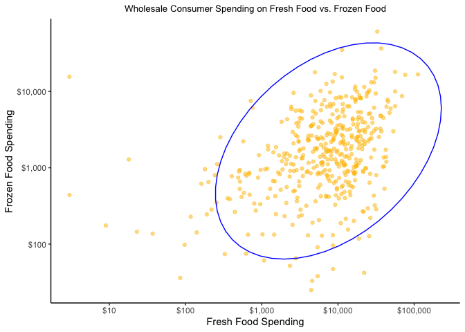<!-- -->

``` r
#2d density estimation
ggplot(data, aes(fres, fro)) +
  geom_point(alpha = 0.5, color = '#FFBF00', position = 'jitter') +
  scale_y_continuous(trans = 'log10', labels = dollar) +
  scale_x_continuous(trans = 'log10', labels = dollar) +
  geom_density_2d() +
  theme_classic() +labs(title = 'Wholesale Consumer Spending on Fresh Food vs. Frozen Food',
     x = 'Fresh Food Spending',
     y = 'Frozen Food Spending') +
   theme(plot.title = element_text(hjust = 0.5, size=10),
        plot.caption = element_text(hjust = 0.5))
```

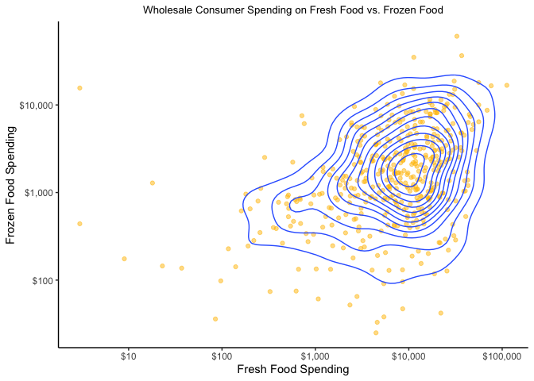<!-- -->

How much do people spend on detergents (non-foods) versus delicacies
(food)? Let’s display it.

``` r
#detergeents and delicacies
ggplot(data, aes(depa, deli)) +
  geom_point(position = 'jitter', alpha=.5, color = '#E34234') +
  scale_y_continuous(trans = 'log10', labels = dollar) +
  scale_x_continuous(trans = 'log10', labels = dollar) +
  stat_ellipse(level = .99, color = "blue") +   
  theme_classic() +
labs(title = 'Wholesale Consumer Spending on Detergents vs. Delicacies',
     x = 'Detergent Spending',
     y = 'Delicacy Spending') +
   theme(plot.title = element_text(hjust = 0.5, size=10),
        plot.caption = element_text(hjust = 0.5))
```

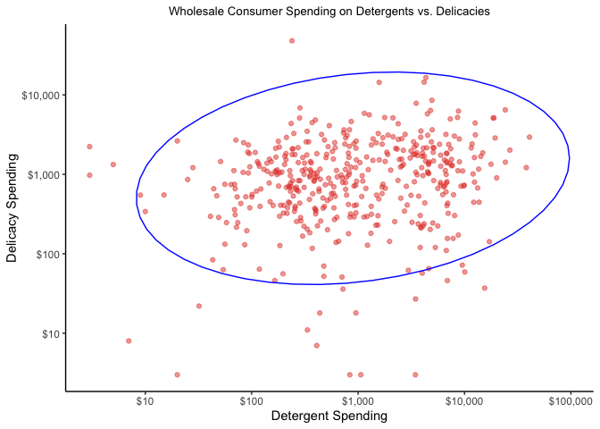<!-- -->

``` r
#2d density estimation
ggplot(data, aes(depa, deli)) +
  geom_point(position = 'jitter', alpha=.5, color = '#E34234')+
  scale_y_continuous(trans = 'log10', labels = dollar) +
  scale_x_continuous(trans = 'log10', labels = dollar) +
  geom_density_2d() +
  theme_classic() +
  labs(title = 'Wholesale Consumer Spending on Detergents vs. Delicacies',
     x = 'Detergent Spending',
     y = 'Delicacy Spending') +
   theme(plot.title = element_text(hjust = 0.5, size=10),
        plot.caption = element_text(hjust = 0.5))
```

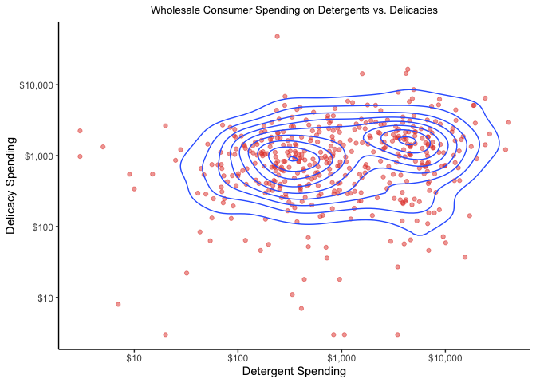<!-- -->

How much do people spend on milk?

``` r
#create a histogram
ggplot(data, aes(milk)) +
  geom_histogram(color='#6E260E', fill = '#964B00') +
  scale_x_continuous(trans = 'log10', labels = dollar) +
  theme_classic() +
  labs(title = 'Wholesale Consumer Spending Milk',
     x = 'Milk Spending',
     y = 'Count') +
   theme(plot.title = element_text(hjust = 0.5, size=10),
        plot.caption = element_text(hjust = 0.5))
```

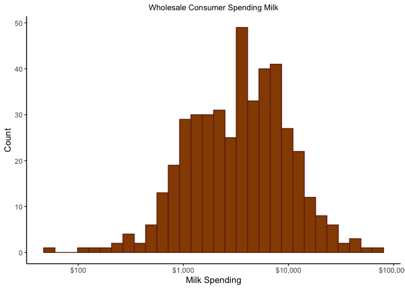<!-- -->

``` r
ggplot(data, aes(milk, groc)) +
  geom_bin2d(bins = 20, color ="white")+
  scale_fill_gradient(low =  "#F2D2BD", high = "#FF00FF")+
  theme_minimal() +
  scale_y_continuous(trans = 'log10', labels = dollar) +
  scale_x_continuous(trans = 'log10', labels = dollar) +
    theme_classic() +
   labs(title = 'Wholesale Consumer Spending Milk versus Grocery',
     x = 'Milk Spending',
     y = 'Gorcery Spending') +
   theme(plot.title = element_text(hjust = 0.5, size=10),
        plot.caption = element_text(hjust = 0.5))
```

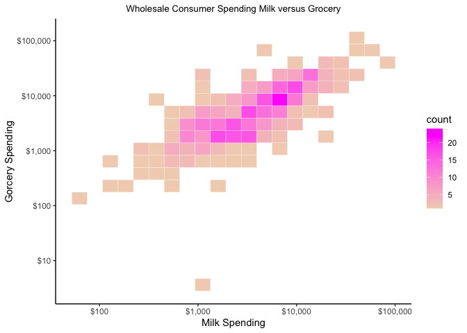<!-- -->

``` r
ggplot(data, aes(milk, fro)) +
  geom_bin2d(bins = 20, color ="white")+
  scale_fill_gradient(low =  "#B6D0E2", high = "#6E260E")+
  theme_minimal() +
  scale_y_continuous(trans = 'log10', labels = dollar) +
  scale_x_continuous(trans = 'log10', labels = dollar) +
    theme_classic() +
     labs(title = 'Wholesale Consumer Spending Milk versus Frozen',
     x = 'Milk Spending',
     y = 'Frozen Spending') +
   theme(plot.title = element_text(hjust = 0.5, size=10),
        plot.caption = element_text(hjust = 0.5))
```

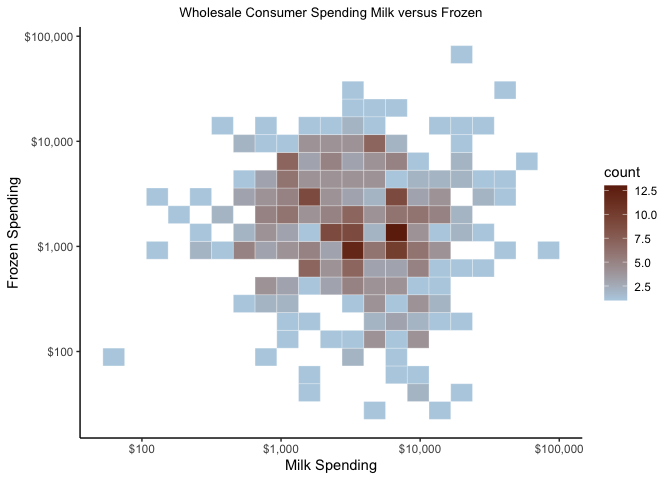<!-- -->

## Clustering

Hierarchical clustering treats each observation as distinct cluster,
also called **agglomerative**. Then it 1) merges two clusters closest
together (via distance) and 2) merges those clusters together and
repeats thsu process until all clusters are merged as one.

<center>


</center>
The main output is a **dendrogram**that shows the relationship between
clusters.
<center>


</center>
The distance between two clusters is based on the **Euclidean
distance**. In order to use it the observation features must be
continuous and thus have numeric values.
<center>


</center>

### Applications

### Pros

-   Easy to understand and implement
-   Works relatively well on small data sets
-   Do not have to indicate any particular number of clusters (cut at
    appropiate levels such as whole vs average

### Cons

-   Does not work well with large datasets. This is an issue because
    many business and organizational datasets tend to be large \>100K
    and visually condensing is difficult.
-   Computatonal demanding.

``` r
#normalize the data and put into a new object
# 2 is for the columns (1 is for rows)
data_mean <- apply(data, 2, mean)
data_sd <- apply(data, 2, sd)
data_norm <-scale(data, data_mean, data_sd)

#calc Euclidean Distance
distance <- dist(data_norm)
```

``` r
#cluster dendrogram with complete linkage
data_hcc <-hclust(distance)

plot(data_hcc)
```

<!-- -->

Each observation is treated as a single cluster and they are group with
the nearest observation and they form a cluster. Then that cluster finds
anothre observation and they form another cluster. This process repeats
til you reach all observation form 1 cluster. In our case, when the
Height=20. This is a **“Complete Linkage”**.

Let’ try the average.

``` r
#cluster Dendrogram with average linkage
data_hca <- hclust(distance, method='average')
plot(data_hca, hang= -1, cex=0.5)
```

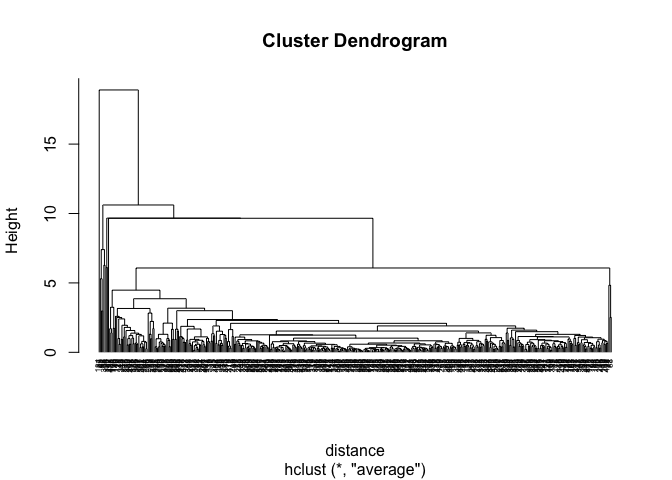<!-- -->

OK, moving forward let’s move on with average.

Let’s find another way to visualize.

``` r
library(ape)
```

    ## 
    ## Attaching package: 'ape'

    ## The following objects are masked from 'package:dendextend':
    ## 
    ##     ladderize, rotate

``` r
plot(as.phylo(data_hca), type = 'fan')
```

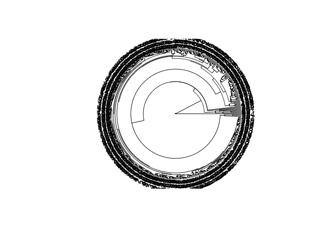<!-- -->

Let’s cut the tree by choosing k. I will use the average instead of the
complete. Since the height is alight above 15, I will choose k to be 2
since during EDA I found 2 clusters in the scatterplot detergent vs
delicacy spending.

``` r
#create dendrogram object
data_hca_object <- as.dendrogram(data_hca)

#color
data_hca_object_dend <-color_branches(data_hca_object, h=2)
plot(data_hca_object_dend,
     leaflab = 'none',
     ylab = 'Height',
     xlab = 'Clusters',
     main = 'Custering Wholesale Customers') +
  abline(h = 2, lty = 2)
```

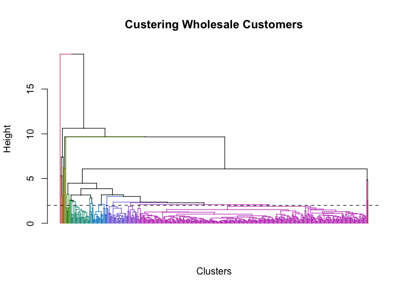<!-- -->

    ## integer(0)

``` r
plot(cut(data_hca_object_dend, h=10)$upper)
```

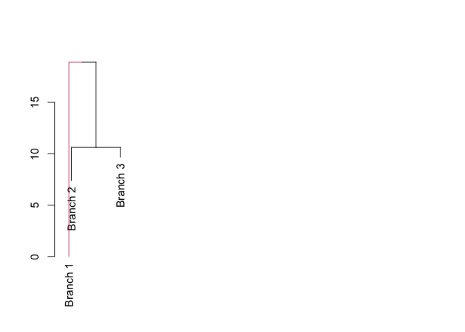<!-- -->

``` r
plot(cut(data_hca_object_dend, h=8)$upper)
```

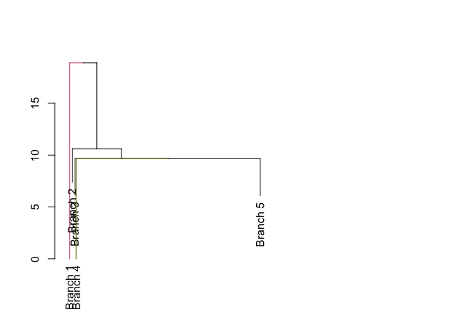<!-- -->

``` r
plot(cut(data_hca_object_dend, h=6)$upper)
```

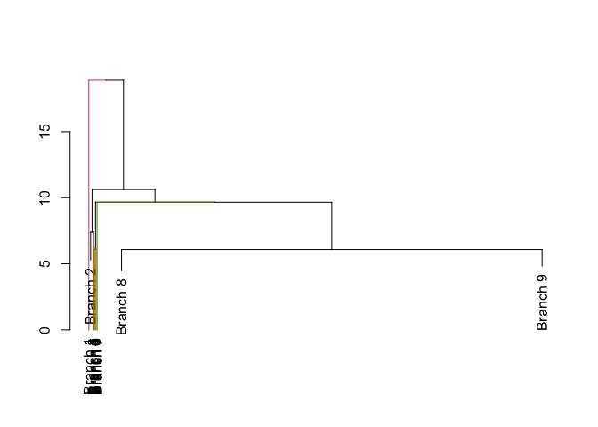<!-- -->

``` r
plot(cut(data_hca_object_dend, h=2)$upper)
```

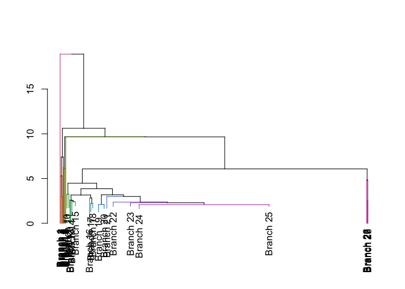<!-- -->

## Limitations

## Conclusions

## Appendix

``` r
ggplot(data, aes(x=milk, y=groc, size=fres)) +
  geom_point(position='jitter', alpha=.5, color='#1E8449') +
  scale_y_continuous(trans = 'log10', labels = dollar) +
  scale_x_continuous(trans = 'log10', labels = dollar) +
    theme_classic() 
```

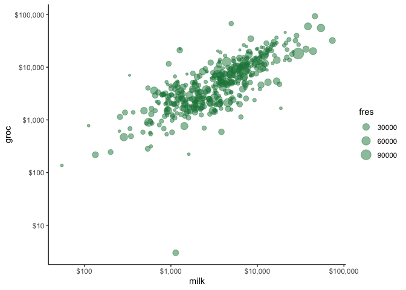<!-- -->

## Inspiration for this project

[^1]: <https://www.simplilearn.com/tutorials/data-science-tutorial/hierarchical-clustering-in-r>
