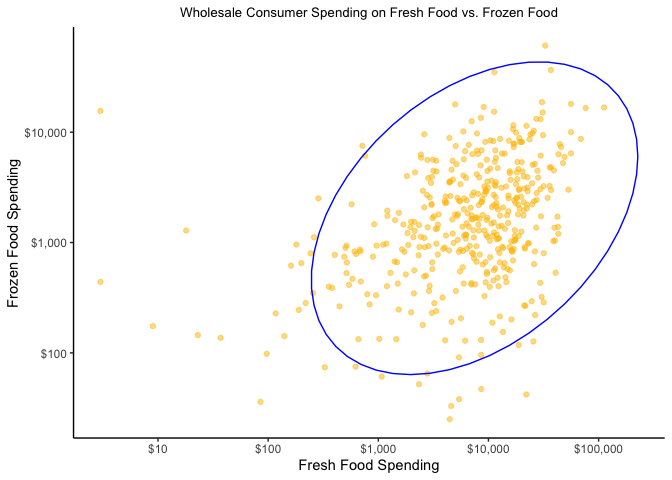
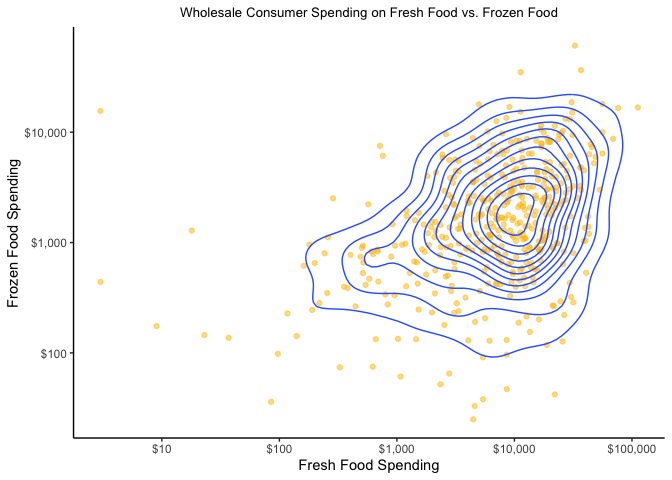
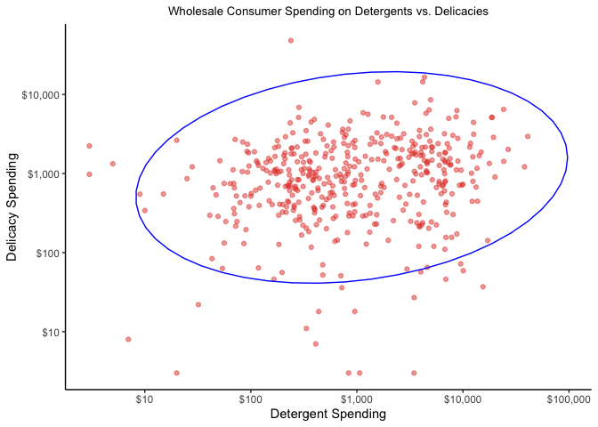
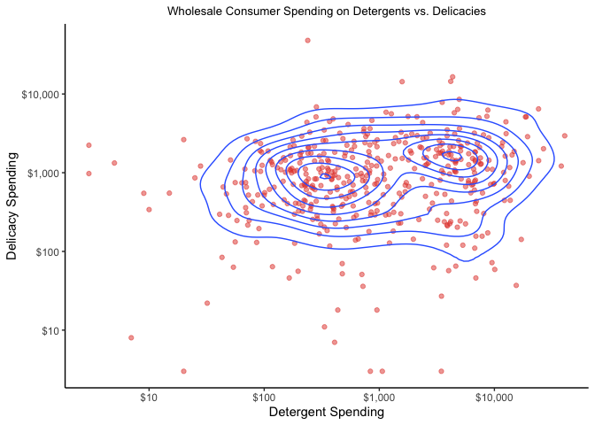
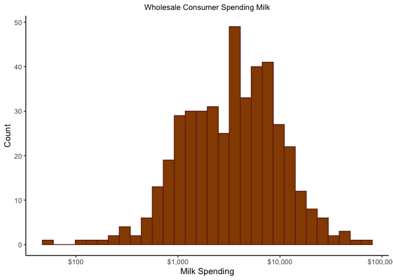
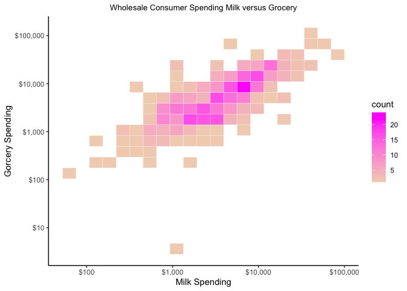
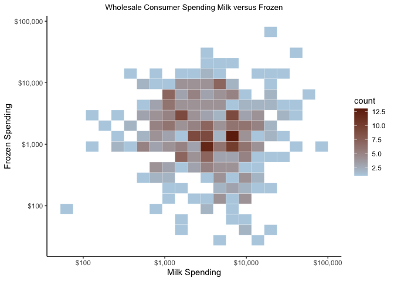
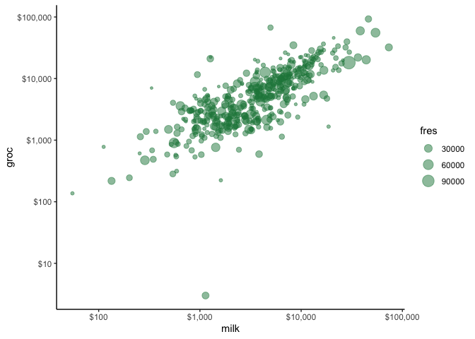

Wholesale Customer Spending Clustering
================
Rex Manglicmot
2022-12-19

-   <a href="#status-continuing-working-document"
    id="toc-status-continuing-working-document">Status: Continuing Working
    Document</a>
-   <a href="#introduction" id="toc-introduction">Introduction</a>
-   <a href="#loading-the-libraries" id="toc-loading-the-libraries">Loading
    the Libraries</a>
-   <a href="#loading-the-data" id="toc-loading-the-data">Loading the
    Data</a>
-   <a href="#cleaning-the-data" id="toc-cleaning-the-data">Cleaning the
    Data</a>
-   <a href="#exploratory-data-analysis"
    id="toc-exploratory-data-analysis">Exploratory Data Analysis</a>
-   <a href="#clustering" id="toc-clustering">Clustering</a>
-   <a href="#limitations" id="toc-limitations">Limitations</a>
-   <a href="#conclusions" id="toc-conclusions">Conclusions</a>
-   <a href="#appendix" id="toc-appendix">Appendix</a>
-   <a href="#inspiration-for-this-project"
    id="toc-inspiration-for-this-project">Inspiration for this project</a>

## Status: Continuing Working Document

## Introduction

<center>


</center>

1)  FRESH: annual spending (m.u.) on fresh products (Continuous);
2)  MILK: annual spending (m.u.) on milk products (Continuous);
3)  GROCERY: annual spending (m.u.)on grocery products (Continuous);
4)  FROZEN: annual spending (m.u.)on frozen products (Continuous)
5)  DETERGENTS_PAPER: annual spending (m.u.) on detergents and paper
    products (Continuous)
6)  DELICATESSEN: annual spending (m.u.)on and delicatessen products
    (Continuous);
7)  CHANNEL: customers’ Channel - Horeca (Hotel/Restaurant/Café) or
    Retail channel (Nominal)
8)  REGION: customers’ Region – Lisnon, Oporto or Other (Nominal)
    Descriptive Statistics:

(Minimum, Maximum, Mean, Std. Deviation) FRESH ( 3, 112151, 12000.30,
12647.329) MILK (55, 73498, 5796.27, 7380.377) GROCERY (3, 92780,
7951.28, 9503.163) FROZEN (25, 60869, 3071.93, 4854.673)
DETERGENTS_PAPER (3, 40827, 2881.49, 4767.854) DELICATESSEN (3, 47943,
1524.87, 2820.106)

## Loading the Libraries

``` r
#load libraries
library(tidyverse)
library(janitor)
library(scales)
library(ggplot2)
```

## Loading the Data

``` r
#load csv file from the UCI website and store it into an object
data_orig <- read.csv('Wholesale customers data.csv')

#view first few rows of the data
head(data_orig)
```

    ##   Channel Region Fresh Milk Grocery Frozen Detergents_Paper Delicassen
    ## 1       2      3 12669 9656    7561    214             2674       1338
    ## 2       2      3  7057 9810    9568   1762             3293       1776
    ## 3       2      3  6353 8808    7684   2405             3516       7844
    ## 4       1      3 13265 1196    4221   6404              507       1788
    ## 5       2      3 22615 5410    7198   3915             1777       5185
    ## 6       2      3  9413 8259    5126    666             1795       1451

## Cleaning the Data

``` r
#make a copy
data <- data_orig

#make the columns to lowercase
data <- janitor::clean_names(data)

#get rid of the categorical variables since clustering deals with continuous variables
data <- data[,-c(1,2)]

#change column names to something shorter
colnames(data) <- c("fres", "milk", "groc", "fro", "depa", "deli")
```

``` r
#check for NAs
sum(is.na(data))
```

    ## [1] 0

``` r
#check for blanks
sum(data =='')
```

    ## [1] 0

``` r
# one more check for blanks
which(data =='', arr.ind=TRUE)
```

    ##      row col

``` r
#one last check
summary(data)
```

    ##       fres             milk            groc            fro         
    ##  Min.   :     3   Min.   :   55   Min.   :    3   Min.   :   25.0  
    ##  1st Qu.:  3128   1st Qu.: 1533   1st Qu.: 2153   1st Qu.:  742.2  
    ##  Median :  8504   Median : 3627   Median : 4756   Median : 1526.0  
    ##  Mean   : 12000   Mean   : 5796   Mean   : 7951   Mean   : 3071.9  
    ##  3rd Qu.: 16934   3rd Qu.: 7190   3rd Qu.:10656   3rd Qu.: 3554.2  
    ##  Max.   :112151   Max.   :73498   Max.   :92780   Max.   :60869.0  
    ##       depa              deli        
    ##  Min.   :    3.0   Min.   :    3.0  
    ##  1st Qu.:  256.8   1st Qu.:  408.2  
    ##  Median :  816.5   Median :  965.5  
    ##  Mean   : 2881.5   Mean   : 1524.9  
    ##  3rd Qu.: 3922.0   3rd Qu.: 1820.2  
    ##  Max.   :40827.0   Max.   :47943.0

Great we see there are no characters or letters in our dataset since
having one would throw off the summary function.

## Exploratory Data Analysis

How much do people spend on fresh versus frozen? Let’s display it.

``` r
#fresh and frozen scatterplot
ggplot(data, aes(fres, fro)) +
  geom_point(position = 'jitter', alpha=0.5, color= '#FFBF00') +
  scale_y_continuous(trans = 'log10', labels = dollar) +
  scale_x_continuous(trans = 'log10', labels = dollar) +
  stat_ellipse(level = .99, color = "blue") +
  theme_classic()+
labs(title = 'Wholesale Consumer Spending on Fresh Food vs. Frozen Food',
     x = 'Fresh Food Spending',
     y = 'Frozen Food Spending') +
   theme(plot.title = element_text(hjust = 0.5, size=10),
        plot.caption = element_text(hjust = 0.5))
```

<!-- -->

``` r
#2d density estimation
ggplot(data, aes(fres, fro)) +
  geom_point(alpha = 0.5, color = '#FFBF00', position = 'jitter') +
  scale_y_continuous(trans = 'log10', labels = dollar) +
  scale_x_continuous(trans = 'log10', labels = dollar) +
  geom_density_2d() +
  theme_classic() +labs(title = 'Wholesale Consumer Spending on Fresh Food vs. Frozen Food',
     x = 'Fresh Food Spending',
     y = 'Frozen Food Spending') +
   theme(plot.title = element_text(hjust = 0.5, size=10),
        plot.caption = element_text(hjust = 0.5))
```

<!-- -->

How much do people spend on detergents (non-foods) versus delicacies
(food)? Let’s display it.

``` r
#detergeents and delicacies
ggplot(data, aes(depa, deli)) +
  geom_point(position = 'jitter', alpha=.5, color = '#E34234') +
  scale_y_continuous(trans = 'log10', labels = dollar) +
  scale_x_continuous(trans = 'log10', labels = dollar) +
  stat_ellipse(level = .99, color = "blue") +   
  theme_classic() +
labs(title = 'Wholesale Consumer Spending on Detergents vs. Delicacies',
     x = 'Detergent Spending',
     y = 'Delicacy Spending') +
   theme(plot.title = element_text(hjust = 0.5, size=10),
        plot.caption = element_text(hjust = 0.5))
```

<!-- -->

``` r
#2d density estimation
ggplot(data, aes(depa, deli)) +
  geom_point(position = 'jitter', alpha=.5, color = '#E34234')+
  scale_y_continuous(trans = 'log10', labels = dollar) +
  scale_x_continuous(trans = 'log10', labels = dollar) +
  geom_density_2d() +
  theme_classic() +
  labs(title = 'Wholesale Consumer Spending on Detergents vs. Delicacies',
     x = 'Detergent Spending',
     y = 'Delicacy Spending') +
   theme(plot.title = element_text(hjust = 0.5, size=10),
        plot.caption = element_text(hjust = 0.5))
```

<!-- -->

How much do people spend on milk?

``` r
#create a histogram
ggplot(data, aes(milk)) +
  geom_histogram(color='#6E260E', fill = '#964B00') +
  scale_x_continuous(trans = 'log10', labels = dollar) +
  theme_classic() +
  labs(title = 'Wholesale Consumer Spending Milk',
     x = 'Milk Spending',
     y = 'Count') +
   theme(plot.title = element_text(hjust = 0.5, size=10),
        plot.caption = element_text(hjust = 0.5))
```

<!-- -->

``` r
ggplot(data, aes(milk, groc)) +
  geom_bin2d(bins = 20, color ="white")+
  scale_fill_gradient(low =  "#F2D2BD", high = "#FF00FF")+
  theme_minimal() +
  scale_y_continuous(trans = 'log10', labels = dollar) +
  scale_x_continuous(trans = 'log10', labels = dollar) +
    theme_classic() +
   labs(title = 'Wholesale Consumer Spending Milk versus Grocery',
     x = 'Milk Spending',
     y = 'Gorcery Spending') +
   theme(plot.title = element_text(hjust = 0.5, size=10),
        plot.caption = element_text(hjust = 0.5))
```

<!-- -->

``` r
ggplot(data, aes(milk, fro)) +
  geom_bin2d(bins = 20, color ="white")+
  scale_fill_gradient(low =  "#B6D0E2", high = "#6E260E")+
  theme_minimal() +
  scale_y_continuous(trans = 'log10', labels = dollar) +
  scale_x_continuous(trans = 'log10', labels = dollar) +
    theme_classic() +
     labs(title = 'Wholesale Consumer Spending Milk versus Frozen',
     x = 'Milk Spending',
     y = 'Frozen Spending') +
   theme(plot.title = element_text(hjust = 0.5, size=10),
        plot.caption = element_text(hjust = 0.5))
```

<!-- -->

## Clustering

## Limitations

## Conclusions

## Appendix

``` r
ggplot(data, aes(x=milk, y=groc, size=fres)) +
  geom_point(position='jitter', alpha=.5, color='#1E8449') +
  scale_y_continuous(trans = 'log10', labels = dollar) +
  scale_x_continuous(trans = 'log10', labels = dollar) +
    theme_classic() 
```

<!-- -->

## Inspiration for this project
